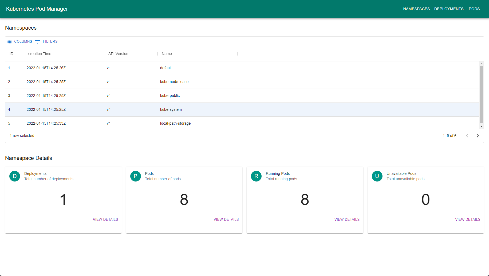

# KubePM GUI (WIP)

This project aims to provide a simple way for users to scale, restart or modify pods and deployments within Kubernetes.



## Running Locally 

KubePM can be run locally and access external clusters using your kube config file. To simply run perform the following: 

```
mvn spring-boot:run
```

## Running Inside Kubernetes 

Currently in progress 


