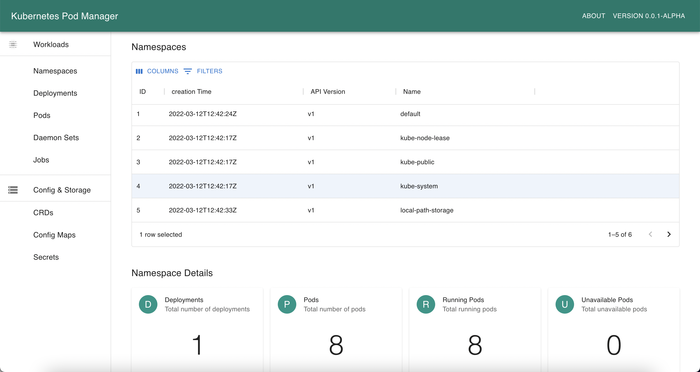

# KubePM GUI (WIP)

This project aims to provide a simple way for users to scale, restart or modify pods and deployments within Kubernetes.



## Features 

* View namespaces, deployments, service accounts, pods (WIP) more
* View logs from a given container
* Rolling restart deployments 
* Change replica counts (WIP)
* View Istio configuration (WIP)

## Running Locally 

KubePM can be run locally and access external clusters using your kube config file. To simply run perform the following: 

```
mvn spring-boot:run
```

## Changelog

### 0.0.2-Alpha

* Support to view service accounts for a given namespace
* Addition of side drawer for enhanced details 
* Fixed navigation pane on left-hand side 
* View deployments 
* Enable autocomplete box to change namespace when viewing deployments

### 0.0.1-Alpha

* Very first initial launch
* View pods
* View namespaces

## Running Inside Kubernetes 

Helm chart due March 2022


